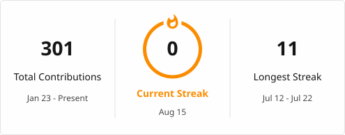
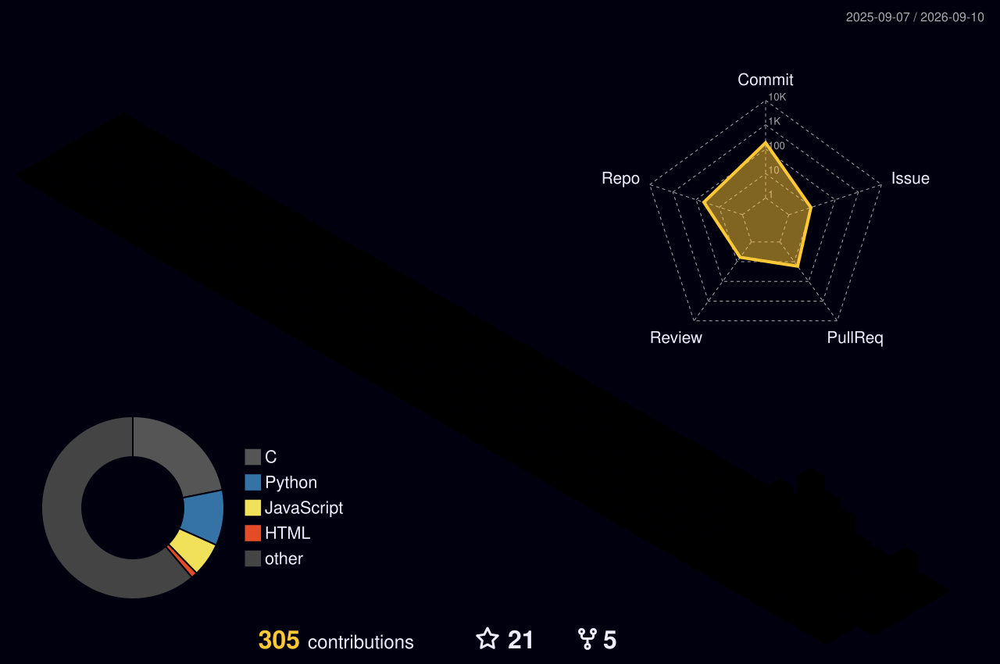

 ## Hi there 
  

- 🔭 I’m currently working on the Hello World project
- 🌱 I’m currently learning Python and Javascript
- 📫 How to reach me: rishichitnis007@gmail.com
- 😄 Pronouns: he/him
- ⚡ Fun fact: I am a ☕️ dependent person
---
I joined GitHub **0** years ago. Since then I pushed **203** commits, opened **10** issues, submitted **23** pull requests, received **26** stars across **12** personal projects, and contributed to **16** 
---
### My Github Streak

---
### 📘 My latest Blog Posts
<!-- Update with recent blog posts:START  -->
- [Update: My Goals and How far I am](https://dev.to/rishichitnis007_80/update-my-goals-and-how-far-i-am-204j)
- [Intro to Javascript](https://dev.to/rishichitnis007_80/intro-to-javascript-4fp9)
- [My Goals and How far I am](https://dev.to/rishichitnis007_80/my-goals-and-how-far-i-am-43ec)
- [Hello](https://dev.to/rishichitnis007_80/hello-433n)
<!-- Update with recent blog posts:END  -->

---

---

